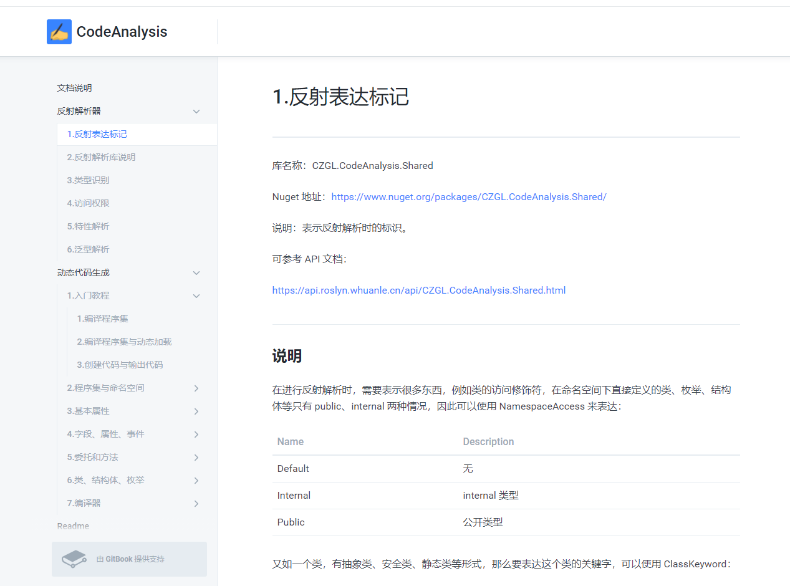

### CZGL.Roslyn

        [](https://996.icu)

[](https://www.nuget.org/packages/CZGL.Roslyn/)   

基于 Roslyn 技术的 C# 动态代码构建器以及编译器，开发者可以使用此库动态构建 C# 代码，并且通过指定条件编译代码。

* 运行时动态构造代码；
* 运行时为程序提供新的模块功能，拓展能力；
* 设计函数平台，以代码片段为单位执行；
* 语法分析提示，编译错误语法警告，精确到代码行；
* 完善的代码标准，避免动态代码语法错误；
* 简洁、简单的 API，完整的 Test 测试；
* ... ...


### 动图演示

这里使用 Blazor 测试演示，代码可以在源码的 `examples/BlazorExample` 中找到。

[注：如无法加载图片，可以点击 [图片git](docs/.images/Blazor 运行 CZGL.Roslyn.gif)]


Blazor 演示的是以命名空间为单位的编译，你可以通过定制后台，实现只需要代码块即可运行，连函数头都不需要。更多功能等你来挖掘！


### 丰富的文档与示例

CZGL.Roslyn 拥有丰富的文档说明和 API 接口说明，让你使用起来得心应手！

文档 URL：[https://1586052146.gitbook.io/codeanalysis](https://1586052146.gitbook.io/codeanalysis)

API URL：[https://czgl-roslyn.github.io/czgl-roslyn](https://czgl-roslyn.github.io/czgl-roslyn)




### 版本更新计划

- [ ] **0.1.0 α版(正在开发中，当前版本)**

  特性：一个具有完整功能的初级版本。

- [ ] **0.2.0 β（beta）版**

  特性：消除了严重的错误和缺陷，完成大量的单元测试等，对代码的可靠性有了极大的提升；能够上线 Nuget 提供用户试用；对用户的需求进行收集，改进程序；

- [ ] **0.3.0 γ版**

该版本已经相当成熟了，根据用户使用 β 版本后的建议和需求进行更新；开始关注性能，进行性能测试已经采取措施对性能进行改进。


### 可以做什么

最大的特点就是动态代码构造以及动态编译，因此我们可以分为两部分讨论。

#### 动态代码生成

* 数据库表还原实体，自动生成类模型文件；(EFCore 有这功能)

* 公司内部定义工具集，通过确定的模板，一键生成代码！

* 通过已确定的逻辑功能，快速生成代码导出！

* 编写 AOP 框架，实现动态代理；

* 代码语法检查；

* 生成计划代码，后台管理哪部分代码可执行；

* 工作流程序通过代码生成一次性构建完毕，工作流程直接写到程序集中，提高性能！

* 快速从表格等各种数据来源，生成代码；

* 自定义 UI 生成器，通过拖拉控件生成代码；

  ... ...


#### 动态编译

* 自研云函数平台，用户上传代码即可直接执行；

* 公司后台计划任务，以程序集为单位，自定义计划执行程序集；

* 编写 AOP 框架，动态编译程序集；

* 单文件(.cs)编译，不需要 SDK、IDE！脱离开发环境编译！

  ... ...

### 与 Natasha 的关系

Natsha 是一个非常优秀的动态代码框架，由大帅主导，形成了功能完整、性能强悍，并且兼容 .NET FX 4.6~.NET Core ↑ ，通过了大量性能测试以及高性能代码优化。

可以以强到不得了来形容。仓库地址：[https://github.com/dotnetcore/Natasha](https://github.com/dotnetcore/Natasha)


那为什么 还要写 CZGL.Rolysn 呢？

1，锻炼技术能力；

2，与 Natasha 不构成竞品， CZGL.Roslyn 尽可能做的轻量，开发者可以考虑业务大小，大型场景使用 Natasha；快速建设使用 CZGL.Roslyn；Natasha 学习曲线比较大，CZGL.Roslyn 学习上手比较快。

3，Natasha 功能完整，依赖比较多；CZGL.Roslyn 功能尽可能足够同时保存少量的依赖，体积小；

4，CZGL.Roslyn 适合写小工具，例如 dotnet-tool、数据库还原实体、为 ML.NET 提供快速代码生成等，适合作为小部件为你的程序提供额外的功能；Natasha 适合作为独立的一个产品去做，围绕 Natasha 构建更多功能；


论性能，Natasha 优秀；论功能完整性，Natasha 一整套大保健服务... ...

CZGL.Roslyn 相比 Natasha ，大概就只有 “轻量” 这个特点了，简直被秒杀。。。


### 我可以从这个框架学习到什么

框架特点是简单易用，你可以从中学习到大量的反射知识，以及 Roslyn 知识，甚至可能学习到 EMIT(后面我会使用这种技术优化性能)。

例如，如何通过取得特性中的属性值？

```csharp
[Display(Name = "_Id")]
public int Id {get;set;}
```

一个 Type ，如何确定他是类、结构体、委托？

如果你查阅资料会发现，`Type.IsClass` 可以识别出类、委托； 

以下代码为什么 JAVA 和 C# 执行结果不同？

```csharp
public class A
{
    public void Test
    {
        Console.WriteLine("A");
    }
}
public class B:A
{
    // 隐藏父类 Test 函数
    public new void Test
    {
        Console.WriteLine("B");
    }
}

A a = new B();
a.Test();
```


目前 CZGL.Roslyn 处于初版，代码还处于非常简单的状态，逻辑也很简单，因此，如果你有意学习 C# 中的反射、动态代码技术等，想了解源代码在生成后如何通过反射获得信息、源代码会被如何编译等，CZGL.Roslyn 就是你最佳的选择。